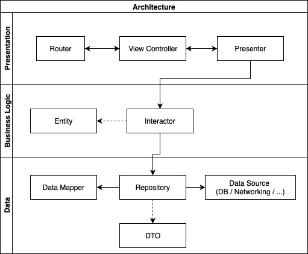

# MS Sample iOS app 📱

mssample-ios is an iOS app showcase built using [TDD](https://en.wikipedia.org/wiki/Test-driven_development) and [DDD](https://en.wikipedia.org/wiki/Domain-driven_design).

I'm not going to introduce anything new to the community but just put together all the pieces of the puzzle and apply the concept to an iOS application.

## Content 📚

* [Requirements](#requirements)
* [Features](#features)
  * [Album](#album)
* [Modularization](#modularization)
* [Architecture](#architecture)
* [License](#license)

## Requirements

* iOS 11.0+
* Xcode 10.2+
* Swift 5

You mush open **MSSampleiOS.xcworkspace**—which includes all the modules.

## Features

### Album

## Modularization

### App

It's the main project of the app and contains the skeleton of our iOS app which orchestrates all the modules.

### Core (+Mock)

The module `Core` provides the main functionalities of the app which must be used by all the vertical modules.
We have also a `CoreMock` to contain the [test doubles](https://marcosantadev.com/test-doubles-swift/) classes of `Core`.

### Album (Vertical module)

The module `Album` is a vertical module and provides the implementation for the feature photo collection and photo details views. It uses `Core` for main functionalities like `UIKit` extensions and networking.

Each module should expose a public router to allow the app to orchestrate the routing.

## Architecture

The core of the architecture follows [3-tier architecture](https://en.wikipedia.org/wiki/Multitier_architecture#Three-tier_architecture) to split and decouple the responsibilities.

* Data Mapper: It maps the data source data with the feature entity (like `AlbumDTO` to `Album`). If we use DTOs, we no longer have to soil our main entities with parsing logics like `Decodable` or 3rd party libraries.
* Repository: It contains the logic to fetch and send the data to the correct data source.
* Interactor: It contains the logic of how to get an entity. It often proxy just the call to a repo. It could seem overkilling but it's a good way to decouple business logic and data logic. It will allows you to scale faster since in the future you might need to orchestrate more than one repo to create the feature model.
* Presenter: It contains the main presentation data logic. It drives the view controller.
* Router: It creates the entire feature stack (Interactor/Presenter/View) and present to a parent `UIKit` controller.

## License

mssample-ios is released under the MIT license. [See LICENSE](LICENSE) for details.
