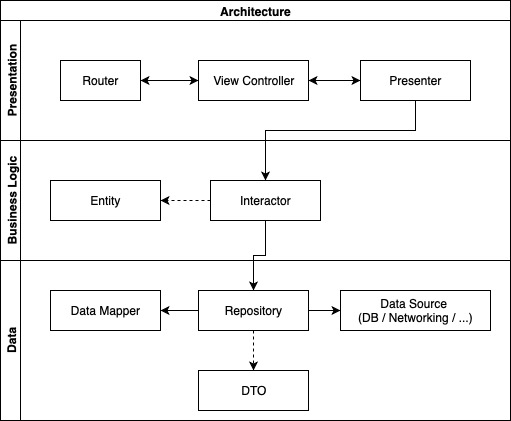

# Architecture



The core of the architecture follows [3-tier architecture](https://en.wikipedia.org/wiki/Multitier_architecture#Three-tier_architecture).

The three layers (Presentation / Business Logic (also called Domain) / Data) are macro blocks to split our architecture objects.

# Content 📚

- [Three-tier_architecture](#three-tier-architecture)
  - [Presentation](#presentation)
    - [Router](#router)
    - [View](#view)
    - [Presenter](#presenter)
  - [Business Logic](#business-logic)
    - [Interactor](#interactor)
  - [Data](#data)
    - [Data Mapper](#data-mapper)
    - [Repository](#repository)
  - [Layers communication](#layers-communication)

## Presentation

The [Presenter](#presenter) is the core of this layer because it drives the data to present and it's agnostic to the UI environment. Instead, the [View](#view) relies on the UI environment frameworks (UIKit/SwiftUI and iOS/macOS/WatchOS) and you might not need a [Router](#router) for a specific feature.

Any other objects added in this layer—like localization and UI configuration—are merely helpers.

### Router

The Router sits on top of multiple features in the same context and it handles the navigation to different views.

_Example:_
You could have an Album context where the Router handles the navigation to a list of albums, list of images of a selected album and the details of a selected image.

Each routing method creates the entire architecture stack and present the [View](#view) in a parent controller—passed through Dependency Injection.

```Swift
public final class AlbumRouter: AlbumRouterProtocol {

    private unowned let parent: NavigationControllerProtocol

    public init(parent: NavigationControllerProtocol) {
        self.parent = parent
    }

    public func presentCollection() {
        // [1]
        let navigation = PhotoCollectionViewController.Navigation(onPhotoDidSelect: { [weak self] photoId in
            self?.presentPhotoDetails(photoId: photoId)
        })
        let viewController = PhotoCollectionViewController(navigation: navigation)
        parent.setRootViewController(viewController)
    }

    public func presentPhotoDetails(photoId: Int) {
        let presenter = PhotoDetailsPresenter(photoId: photoId)
        let viewController = PhotoDetailsViewController(presenter: presenter)
        parent.pushViewController(viewController, animated: true)
    }
}
```

1. `Navigation` is a wrapper structure to keep all the closures necessary for the routing (more details in [View](#view)).

### View

A View is the main UI element—like `UIViewController`, `ContentView` and `NSViewController`. It contains the elements of the screen, handles the own layout and reacts to user actions.

#### Localization

Localization should be handled inside the View. The [Presenter](#presenter) shouldn't provide localized strings since the localization mechanism can change in different UI environments.

We can still test the localization moving the logic in a helper class:

```Swift
final class AlbumLocalizable: Localizable {
    static var bundle = Bundle(for: AlbumLocalizable.self)

    enum LocalizableKey: String {
        case photoCollectionTitle = "photo_collection_title"
    }
}

// View:
title = AlbumLocalizable.localize(key: .photoCollectionTitle)
```

The [Presenter](#presenter) can return plain strings and the View would handle the localization:

```Swift
// View:
title = String(format: AlbumLocalizable.localize(key: .photoCollectionTitle), presenter.albumTitle)
```

#### Navigation

The [View](#view) is responsible to call the `Navigation` closures after an UI action. [Presenter](#presenter) shouldn't have navigation logic since it's a UI environment logic. (SwiftUI and UIKit could have different navigation approaches).

If we need to add business logic for the routing, the [Presenter](#presenter) can expose a method like `isItemAvailable(at:)`:

```Swift
// ViewController with a collection view
func collectionView(_ collectionView: UICollectionView, didSelectItemAt indexPath: IndexPath) {
    guard !presenter.isItemAvailable(at: indexPath.item) else { return }
    navigation.onPhotoDidSelect(photoId)
}
```

### Presenter

The presenter provides the data to show in the [View](#view). A presenter **must not** have any references of the UI. It means that the [View](#view) should handle the entire UI logic.

_Examples:_

- A presenter provides a `Data` object instead of an `UIImage`. The [View](#view) would transform the data to an image.
- A presenter doesn't provide layout information like UI constants. The [View](#view) must handle the own layout. If we need some logic for the layout, you can use a helper class where we inject some business models.
- A presenter has generic method/property names like `var itemsCount: Int` instead of `var tableViewCellCount: Int`.

#### Async communication

A classic scenario is where the presenter fetches a model and then it has to notify the [View](#view) to refresh its content. We can achieve this async communication through a binding. The Presenter provides some closures—implemented in the [View](#view):

```Swift
// View
func viewDidLoad() {
    super.viewDidLoad()

    presenter.onUpdateData = { [weak self] in
        self?.tableView.reloadData()
    }
}

// Presenter
func fetchItems() {
    interactor.getItems { [weak self] in
        self?.onUpdateData()
    }
}
```

**Never** keep a reference of [View](#view) inside the Presenter.

## Business Logic

### Interactor

It contains the logic of how to get an entity. It often proxy just the call to a repo. It could seem overkilling but it's a good way to decouple business logic and data logic. It will allows you to scale faster since in the future you might need to orchestrate more than one repo to create the feature model.

## Data

### Data Mapper

It maps the data source data with the feature entity (like `AlbumDTO` to `Album`). If we use DTOs, we no longer have to soil our main entities with parsing logics like `Decodable` or 3rd party libraries.

### Repository

It contains the logic to fetch and send the data to the correct data source.

## Layers communication

<!-- lower layers don't have reference of upper layers. Only opposite -->
